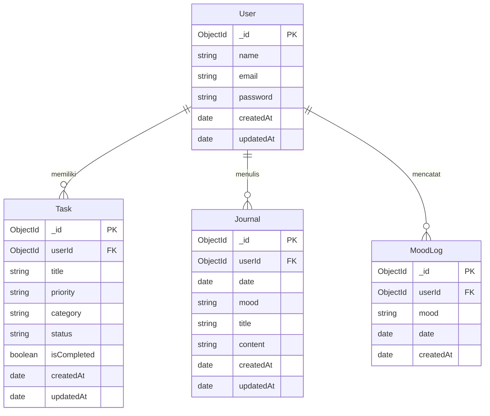

# Analisis Database & Rancangan Skema - DailyLife Web Application

Berdasarkan analisis fitur-fitur yang ada di dalam aplikasi web **DailyLife** (dari file EJS, router, controller, dan `REQUIREMENTS.md`), aplikasi ini membutuhkan database **NoSQL** karena menggunakan **Mongoose** dan **MongoDB** (terindikasi dari package dependencies `mongoose` di `package.json` dan variabel lingkungan `MONGO_URL` di `.env`).

Berikut adalah analisis kebutuhan database, relasi antarentitas, beserta rancangan skema Mongoose untuk mendukung semua fitur aplikasi.

---

## 1. Kebutuhan Database

Aplikasi membutuhkan **MongoDB** untuk mengelola data relasional ringan (terkait pengguna) serta data dokumen yang dinamis untuk Tugas (Todo) dan Jurnal Harian. Untuk menghubungkan aplikasi Express dengan MongoDB, kita menggunakan pustaka **Mongoose ODM (Object Document Mapper)**.

Kebutuhan koleksi database (Collections):
1. **users**: Menyimpan informasi autentikasi pengguna (Registrasi & Login).
2. **tasks** (atau **todos**): Menyimpan daftar tugas pengguna, yang terhubung dengan `userId`.
3. **journals**: Menyimpan catatan jurnal harian pengguna beserta mood-nya, terhubung dengan `userId`.
4. **products** *(Koleksi bawaan)*: Model produk yang sudah ada di codebase.

---

## 2. Skema Database (Mongoose Schema)

### 2.1 Skema Pengguna (`User`)
Skema ini menyimpan data kredensial pengguna untuk autentikasi (Registrasi dan Login).

```javascript
const mongoose = require("mongoose");

const userSchema = new mongoose.Schema(
  {
    name: {
      type: String,
      required: [true, "Nama lengkap wajib diisi"],
      trim: true,
    },
    email: {
      type: String,
      required: [true, "Email wajib diisi"],
      unique: true,
      lowercase: true,
      trim: true,
      match: [
        /^\w+([.-]?\w+)*@\w+([.-]?\w+)*(\.\w{2,3})+$/,
        "Format email tidak valid",
      ],
    },
    password: {
      type: String,
      required: [true, "Password wajib diisi"],
      minlength: [8, "Password minimal harus 8 karakter"],
    },
  },
  {
    timestamps: true, // Otomatis membuat createdAt & updatedAt
  }
);

module.exports = mongoose.model("User", userSchema);
```

---

### 2.2 Skema Tugas (`Task` / `Todo`)
Skema ini mencatat tugas yang dibuat oleh pengguna. Setiap tugas terhubung ke satu pengguna via `userId` (Relasi One-to-Many).

```javascript
const mongoose = require("mongoose");

const taskSchema = new mongoose.Schema(
  {
    userId: {
      type: mongoose.Schema.Types.ObjectId,
      ref: "User",
      required: true,
    },
    title: {
      type: String,
      required: [true, "Nama tugas wajib diisi"],
      trim: true,
    },
    priority: {
      type: String,
      enum: ["low", "medium", "high"],
      default: "medium",
    },
    category: {
      type: String,
      enum: ["personal", "work", "ideas"],
      default: "work",
    },
    status: {
      type: String,
      enum: ["To Do", "In Progress", "Done", "Failed"],
      default: "To Do",
    },
    isCompleted: {
      type: Boolean,
      default: false,
    },
  },
  {
    timestamps: true,
  }
);

// Indexing userId untuk pencarian tugas cepat berdasarkan user
taskSchema.index({ userId: 1 });

module.exports = mongoose.model("Task", taskSchema);
```

---

### 2.3 Skema Jurnal Harian (`Journal`)
Skema ini menyimpan entri catatan jurnal pengguna beserta track mood harian. Entri ini terhubung ke satu pengguna via `userId` (Relasi One-to-Many).

```javascript
const mongoose = require("mongoose");

const journalSchema = new mongoose.Schema(
  {
    userId: {
      type: mongoose.Schema.Types.ObjectId,
      ref: "User",
      required: true,
    },
    date: {
      type: Date,
      required: true,
      default: Date.now,
    },
    mood: {
      type: String,
      enum: ["happy", "reflective", "productive", "tired", "stressed"],
      required: [true, "Pilihan mood hari ini wajib diisi"],
    },
    title: {
      type: String,
      required: [true, "Judul jurnal wajib diisi"],
      trim: true,
      default: "Untitled Entry",
    },
    content: {
      type: String,
      required: [true, "Isi jurnal wajib diisi"],
    },
  },
  {
    timestamps: true,
  }
);

// Indexing untuk query jurnal per user dan urutan tanggal
journalSchema.index({ userId: 1, date: -1 });

module.exports = mongoose.model("Journal", journalSchema);
```

---

### 2.4 Skema Log Mood (`MoodLog` - Opsional)
Halaman Dashboard memiliki widget pelacak mood independen ("How is your mood today?"). Jika Anda ingin menyimpan sejarah mood secara berkala tanpa mengharuskan user menulis jurnal, Anda bisa menggunakan skema mood terpisah ini:

```javascript
const mongoose = require("mongoose");

const moodLogSchema = new mongoose.Schema(
  {
    userId: {
      type: mongoose.Schema.Types.ObjectId,
      ref: "User",
      required: true,
    },
    mood: {
      type: String,
      enum: ["reflective", "happy", "productive", "tired"],
      required: true,
    },
    date: {
      type: Date,
      default: Date.now,
    },
  },
  {
    timestamps: true,
  }
);

moodLogSchema.index({ userId: 1, date: -1 });

module.exports = mongoose.model("MoodLog", moodLogSchema);
```

---

## 3. Struktur Relasi Data


